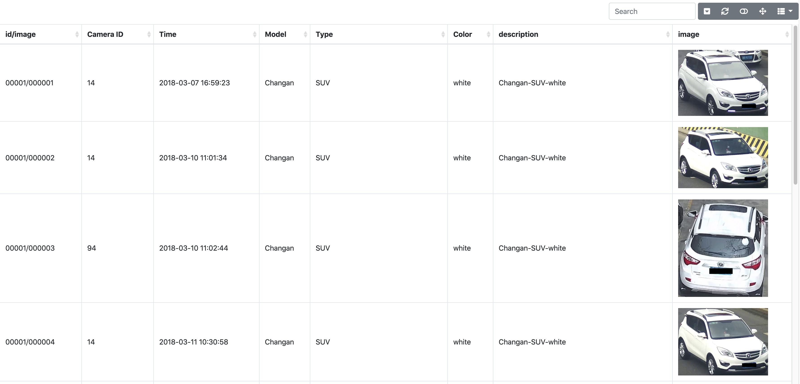
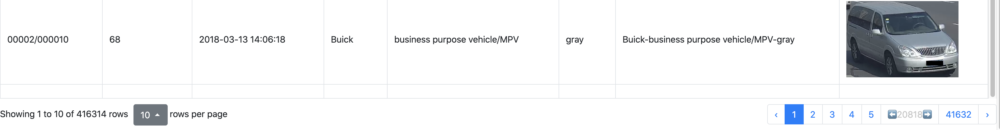

# Show Data: Show your dataset in web browser!

Show Data is to generate html tables for large scale image dataset, especially for the dataset in remote server. 
It provides some useful commond line tools and fully customizeble API reference to generate html table different tasks.

## Examples
It supports filtering data by text, sorting data by coloum values and pagination. 

VeRiWild dataset



ReID Strong baseline Results  


## Install 

```
pip install showdata
```

## Command Line Tools

### Basic usage
Open a file server (replace the python -m http.server)
``` 
showdata server -p <port, default 8000> -h <host, default 0.0.0.0>
```

Visualize images in a folder:
``` 
showdata show -i <folder_path> -o <html_path>
```

Visualize images from pickle or json file:
``` 
showdata show -i example.pkl -o <html_path>
```

Compare images with the same name from different folders 
```
showdata compare <path-a> <path-b> <path-c> -o <output-path>
```

All string values ends with `png`/`jpg`/`jpeg` will be rendered to images. Others are rendered to text.

### Image Dict 

If you pass a json file, you can set the image values to a dict to provide more customizeble configurations. 

For example, 
```json
[
    {
        "name": "001",
        "img": {
            "src": "images/0001.jpg",
            "text": "The text will be shown on the top of the image",
            "style": "border: 2mm solid green"
        }
    }
    {
        "name": "002",
        "img": {
            "src": "images/0002.jpg",
            "text": "blabla",
            "style": "border: 2mm solid red"
        }
    }
]
```

Run `python -m http.server` and open your web browser to check the generated web page.

## API
```python
from showdata import generate_html_table
data = [
    {
        "idx": 1,
        "label": 'cat',
        "img": 'images/cat.jpg',
        "mask": 'images/cat_mask.png',
    },
    {
        "idx": 2,
        "label": 'dog',
        "img": 'images/dog.jpg',
        "mask": 'images/dog_mask.png',
    },
]
generate_html_table(data, output_path='index.html')
```
